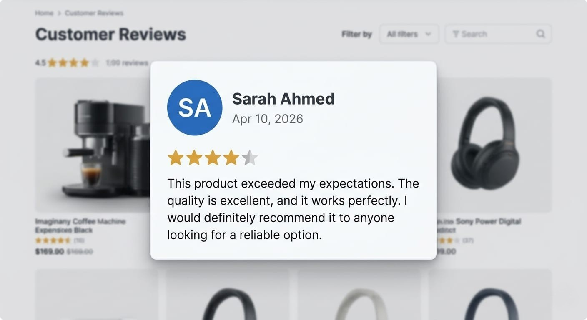

Customer Review Component
A clean and modern **Customer Review UI Component** designed for e-commerce platforms.  
This component displays user feedback in a structured, visually appealing, and reusable format.

Overview

This project showcases a standalone review card that includes:
- Reviewer name
- Review date
- 5-star rating visualization
- Customer feedback text
The component is designed to be easily integrated into any e-commerce website.

Preview

Features

- Clean and modern UI design  
- 5-star rating visualization  
- Responsive layout (mobile-friendly)  
- Reusable component  
- Clear visual hierarchy for better UX  

Design Thinking

The component is built with a focus on:

- **User Experience (UX):** Easy to read and visually structured  
- **Visual Hierarchy:** Name → Rating → Review text  
- **Reusability:** Can be used multiple times across pages  
- **Simplicity:** Minimal design with maximum clarity  

Technologies Used

- HTML5  
- CSS3  
- (Optional) JavaScript for dynamic ratings  

